# <h1 align=center> **Proyecto Final Grupal de HENRY** </h1>

<p align=center> </p>

# <h1 align=center>**`NY_TaxiGreen: Análisis del movimiento de taxis en la ciudad de Nueva York y su relación con la calidad del aire y la contaminación sonora.`**</h1>

 📔: [Reporte Técnico Completo](https://crichubiava.atlassian.net/l/cp/14Q0CXYV)

### **`Equipo`**</h2>


|  |  |  |  |  |
|:---------------:|:---------:|:---------:|:---------:|:---------:| 
|<sub> Araque Roldan Mauricio Alejandro (https://github.com/araquester)</sub>|<sub> Biava, Cristian (https://github.com/Crichu)</sub>|<sub> López Guerra, Adriana Gabriela(https://github.com/AdrianaGLG)</sub>|<sub>Luna Paez, Gastón Ramiro (https://github.com/ramirou2)</sub>|<sub> Rappaport, Fernando Ariel (https://github.com/TheFercho)</sub>|


### **`Esquema del Repositorio`**</h3>

```Python
.
├── Complementary  (Datasets complementarios)
|       └── fuel_consumption_ratings  
|       └── yellow_taxis
    ├── air_quality_data.csv  (Dataset_CM_01)
    ├── car_noise.csv  (Dataset_CM_02)
    ├── weather.csv  (Dataset_CM_03)
├── Datasets    (Datasets bases)
|       └── Datasets_Clean  
|            ├── Alternative Fuel Vehicles US.csv
|            ├── ElectricCarData_Clean.csv
|            ├── Electric_and_Alternative_Fuel_Charging_Stations.csv
|            ├── Light Duty Vehicles.csv
|            ├── Vehicle Fuel Economy Data.csv
|            ├── taxi+_zone_lookup.csv
|            ├── taxi_zones.csv
    ├── Alternative Fuel Vehicles US.csv  (Dataset_01)
    ├── Electric and Alternative Fuel Charging Stations.csv  (Dataset_02)
    ├── ElectricCarData_Clean.csv  (Dataset_03)
    ├── ElectricCarData_Norm.csv  (Dataset_04)
    ├── Light Duty Vehicles.csv  (Dataset_05)
    ├── Vehicle Fuel Economy Data.csv  (Dataset_06)
    ├── data_dictionary_trip_records_yellow.pdf
    ├── taxi+_zone_lookup.csv (Dataset_07)
    ├── taxi_zones.dbf
├── EDA_Notebooks
    ├── EDA_Dataset_01_&_03.ipynb
    ├── EDA_Dataset_02.ipynb
    ├── EDA_Dataset_06.ipynb
    ├── EDA_Dataset_CM_01.ipynb
    ├── EDA_Dataset_CM_02_&_03_&_Tripdata_2023_05_parquet.ipynb
    ├── EDA_fuel_consumption_ratings.ipynb
├── ETL_Notebooks
|        └── Normalizacion_Columnas
|           ├── normalizacion_Datasets_bases.ipynb
|           ├── normalizacion_Datasets_complementarios.ipynb
    ├── ETL_Dataset_01_&_03_&_04_&_07.ipynb
    ├── ETL_Dataset_02.ipynb
    ├── ETL_Dataset_06.ipynb
    ├── ETL_Dataset_07.ipynb
    ├── ETL_Dataset_CM_01.ipynb
    ├── ETL_Dataset_CM_02_&_03.ipynb
    ├── ETL_fuel_consumption_ratings.ipynb
├ .gitignore
├ README.md
├ requirements.txt


```

# <h2 align=left> **Informe** </h2>

### **`Propósito del proyecto`**

​Taxi Green, una empresa de servicios de transporte de pasajeros, que actualmente se encuentra operando en el sector de micros de media y larga distancia, está interesada en invertir en el sector de transporte de pasajeros con automóviles.

Con una visión de un futuro menos contaminado y ajustarse a las tendencias de mercado actuales, quieren corroborar la relación entre estos medios de transporte particulares con:

* Calidad del aire

* Contaminación sonora

Propósito: estudiar la posibilidad de implementar vehículos eléctricos a su flota; ya sea en su totalidad o parte de la misma.

Se pretende hacer un análisis preliminar del movimiento de los taxis en la ciudad de Nueva York, para poder obtener un marco de referencia y poder tomar decisiones bien fundamentadas.​

### **`Objetivo general`**

Análisis del movimiento vehicular en NYC y su relación con la contaminación del aire y sonora.

### **`Objetivos específicos`**

Comprobar:

Relación entre el mercado automotor y las actividades de transporte en la ciudad de Nueva York con:

    *   La calidad del aire (emisiones de CO2).

    *   La contaminación sonora.

    *   Efecto de las condiciones climáticas con la cantidad de viajes solicitados. 

### **`KPIs Propuestos`**

Se proponen los siguientes KPIs con base de medición trimestral:

* Promedio de emisión de CO2 de la nueva flota menor a 3


* Ruido promedio por diseño de la nueva flota 50 dB


  
* Vehículos eléctricos en la flota > 60%


  
* autonomía de la nueva flota entre > 300 km


  
* Antigüedad de la flota < 3 años (ningún vehículo puede tener más de 3 años)


### **`Alcance (Desarrollar)`**

> [!IMPORTANT]
> Crucial information necessary for users to succeed.
> Debe tener:
>  * Análisis descriptivo del movimiento de los taxis en NYC (patrones por semana, franja horaria). Si hay datos, incluir también: micros, uber, vehículos particulares, tipos de motor (combustible, eléctrico, híbrido).
>
> * Análisis descriptivo de la relación entre uso de medios de transporte particulares y la calidad del aire según el área (¿Qué medios se utilizan y cuál es el nivel de contaminación del aire?).
>
> * Análisis descriptivo de la relación entre uso de medios de transporte particulares y la contaminación sonora (¿Qué medios se utilizan y cuál es el nivel de contaminación sonora?).
>
> * Modelo predictivo ML: evolución de la calidad del aire en función del uso de los medios de transporte (distintos escenarios considerando distintos tipos de medios de transporte)
>
> * Modelo predictivo ML: modelar la evolución de la contaminación sonora en función del uso de los medios de transporte (distintos escenarios considerando distintos tipos de medios de transporte)
>
> * Aplica para todo: comparar datos de autos a combustión, autos eléctricos, autos híbridos (la actividad que quiere estudiar la empresa) vs micros (la actividad actual de la empresa)

> [!NOTE]\
> Podría tener:
> * Modelo para analizar tarifas variables en base al movimiento de las distintas franjas de días y horarios y condiciones climáticas.
> * Análisis del retorno de la inversión en una flota de autos eléctricos.

> [!WARNING]\
> Fuera del alcance:
> * Análisis de marketing
> * Calificación de servicios y/o condutores

### **`Matriz de responsabilidades`**

:black_circle: Main

:small_red_triangle:  Support


# <h2 align=left> **Plan de trabajo** </h2>

| Hito | Nombre | Entregables | Esperado | Fecha |
|:---------------:|:---------:|:---------:|:---------:|:---------:|
| Demo Sprint #1 | Data Ingest  Process | Puesta en marcha el proyecto y Trabajando los Datos: <br> * Kickoff del proyecto  <br>* Entendimiento de las necesidades <br>* Documentar alcance , objetivo y entregables <br>* KPI’s <br>* Implementación de stack propuesto | * Más de 4 KPIs <br>* Mencionar las tecnologías a usar <br>* Documentación de alcance del proyecto <br>* EDA preliminar, calidad del dato <br>* Repo Github <br>* Planificación y estimación de esfuerzos (Diagrama de Gantt) | 09/08/2023 |
|Demo Sprint #2 | Data Analytics & ML |Data Engineering:<br> * Arquitectura propuesta y diagrama<br> * Diccionarios de datos <br> * Creación del DW <br> * Automatizar el DW <br> * Carga incremental | * DW con herramientas Big Data (HDFS, Hive, Spark y/o motores No-SQL y/o Servicios Cluod) <br> * DW automatizado con carga inicial <br> * Al menos 2 tablas de hechos y 5 dimensionales  <br> * Carga incremental de datos (video) | 23/08/2023
| Demo Sprint #3 | Data Analytics y ML |Etapa de Analytics y Machine Learning <br> * Dashboard <br> * Reportes <br> * Storytelling <br> * Modelo ML <br> * Ajustes del modelo |* Implementar modelo de ML <br> * Implementar un reporte de visualización geográfica.|06/09/2023
| |Demo Final |  * Demo general del proyecto <br> * Entregable final<br> * Documentación| * Presentación dirigida a la dirección de la compañía. <br> * Retomar lo mostrado en presentaciones anteriores. <br> * Retoques finales en base a recomendaciones de HM y PO. | 06/09/2023 |
***

### <h3 align=left>**`Propuesta de trabajo`** </h3>
***

### Recopilación y limpieza
- [x] Se utilizan los archivos .csv provistos por el cliente. También se estudian los datasets complementarios facilitados por el cliente, así como también información extra recopilada por el equipo.
- [x] Los datasets provienen tanto de archivos .csv como de APIs. Estos últimos son extraídos con técnicas de web scrapping. 
- [x] Los dataset considerados necesarios para el desarrollo del producto final del proyecto, se limpian, ordenan y normalizan.
- [x] Además, se realiza un análisis exploratorio de datos con el objetivo de detectar insights de interés para el cliente.

`Tecnología y librerías utilizadas: Python, Pandas, Numpy, os`

### Creación de un diccionario y diagrama DER
- [x] Los datasets son procesados y analizados para generar un diccionario de las variables de interés. 
- [x] Se utiliza esta información para establecer un diagrama de entidad - relación que facilite su posterior análisis

### Disponibilización de la información
- [x] Se crea un DataWarehouse utilizando las herramientas Cloud de Google.

`Tecnología y librerías utilizadas: MySQL, Google Cloud`

### Análisis de la información y Dashboard interactivo
- [x] Se diseña un dashboard con información relevante para el negocio teniendo en cuanta los KPIs definidos para tal fin.

`Tecnología y librerías utilizadas: Power BI / Streamlit /Locker studio?`

### Modelo de Machine Learning
- [x] Modelo predictivo ML: evolución de la calidad del aire en función del uso de los medios de transporte (distintos escenarios considerando distinta composición de la flota en cuanto a modelos de auto)
- [x] Modelo predictivo ML: modelar la evolución de la contaminación sonora en función del uso de los medios de transporte (distintos escenarios considerando distinta composición de la flota en cuanto a modelos de auto)

`Tecnología y librerías utilizadas: Python, Pandas, Numpy, Seaborn, Matplotlib, sklearn`

### App / Web interactiva
- [x] El modelo de machine learnig de disponibiliza a través de una página web, facilitando la interacción con el cliente.
- [x] Tecnología y librerías utilizadas: Python, FastAPI, Render

### <h3 align=left>**`Definición de identidad visual de marca`** </h3>

### Desarrollo de un logotipo

El desarrollo de un logotipo implica la creación de un símbolo visual o un diseño gráfico que representa la esencia de la marca. El logotipo puede consistir en una combinación de elementos como formas, letras, imágenes o iconos que juntos comunican la identidad y los valores de la empresa. 

Para nuestro proyecto, desarrollamos el logotipo de la empresa consultora (Taxi Green) y el de nuestro grupo de trabajo (LBD) a través de la evaluación de las alternativas que ofrecían plataformas de diseño tales como:

- Tailor Brands | Small Business Set-up Made Easy 
- Logo Maker | Used By 2.3 Million Startups  
- Diseña un Logo con Nuestro Creador de Logo Gratis | FreeLogoServices  
- Crear Logos Gratis - Creador de logos - Free Logo Design

### Opciones de logo
|  |  |  |  |  |
|:---------------:|:---------:|:---------:|:---------:|:---------:| 
|  |  |  |  |  |

### Grupalmente se definió el diseño final del grupo de trabajo:

<p align= Center>Logo Final Empresa <br>
 </p>

<p align= Center>Logo Corporativo <br>
 </p>

## Trabajo realizado en ETL

### Recopilación y limpieza

En la carpeta Datasets se encuentran los archivos .csv con la información provista por el cliente que contienen los datos a ser procesados.

En general, se realizó un proceso de limpieza y transformación de todos los dataset que incluyó:

- Eliminar columnas sin utilidad.

- Reemplazar o eliminar valores nulos, duplicados, faltantes y NA.

- Normalizar datos.

Seguidamente, se llevó a cabo un análisis exploratorio de los datos con el objetivo de detactar insights que puedan aportar información valiosa en las posteriores etapas del proyecto.

## ETL y EDA de datasets relacionados con la emisión de CO2

### Alternative Fuel Vehicles US.csv

Contiene información sobre vehículos de combustible alternativo en Estados Unidos. Es una recopilación sobre vehículos de combustible alternativo en Estados Unidos, incluyendo sus características técnicas y de rendimiento.

Consta de 882 filas y 22 columnas. Cada fila representa un vehículo específico, mientras que las columnas contienen información y características técnicas relacionadas con los vehículos.

> EDA Detalle

En el siguiente gráfico se puede apreciar que en el Top5 se encuentran 3 marcas alemanas: Audi, Mercedes Benz y BMW, todos con fama de buen funcionamiento y motores de alto rendimiento y potencia, además de ser marcas muy reconocidas a nivel mundial, generalmente asociadas a un nivel alto de poder adquisitivo.

También se encuentran Ford, la marca Norteamericana por excelencia y Toyota, también muy reconocida a nivel mundial y sinónimo de confiabilidad.

Se puede concluir que el mercado estadounidense se inclina hacia marcas de renombre y reconocidas por su mecánica potente, confiable y duradera.
<p align= Center>
 </p>

Así mismo,  los vehículos híbridos (Hybrid Electric) se destacan por el resto, notando el arraigo de la sociedad a desprenderse del uso del petroleo, ya sea por comodidad, potencia, fidelidad, etc.
<p align= Center>
 </p>

Sin embargo, en lo que eficiencia energética se refiere, en este caso, reflejada por la autonomía en marcha puramente eléctrica, los vehículos eléctricos sacan una ventaja considerable sobre los híbrido.

El siguiente histograma muestra que la autonomía media de los modelos eléctricos evaluados ronda los 250 km, En su mayoría superan los 200 km y alcanzan valores de hasta 500 km.
<p align= Center>
 </p>

### ElectricCarDat_Clean.csv

Contiene datos relacionados con vehículos eléctricos. 

Consta de 103 filas y 14 columnas. Cada fila representa un modelo específico de coche eléctrico y cada columnas proporciona información detallada sobre sus características, incluyendo sus detalles de rendimiento, autonomía, eficiencia y opciones de carga entre otras.

> EDA Detalle

Correlación Autonomía (rango eléctrico) - Precio

En el siguiente gráfico se presenta lo que parece una correlación positiva entre el precio y el rendimiento en km (autonomía). 

Se observa un outlier con autonomía de 1.000 km y precio de 200.000 euros que corresponde al segmento es un S, donde se enmarcan los súper deportivos.

En línea con esto, cabe destacar la correspondencia del tipo de segmento con el precio y la autonomía. Vale decir que los mejores rendimientos y mayores precios van de la mano con el segmento, notese el F que se refiere a sedanes de lujo y S que son los súper deportivos. En cuanto a los del segmento A son los más económicos, pequeños y de menor rendimiento.

Para destacar en este punto tenemos en el área central a vehículos con una autonomía de alrededor de 400 km y un precio promedio de 60 000 euros, correspondientes al segmento C (compactos de 5 pasajeros) y D (Segmento mejorado en espacio, rendimiento y confort, con un precio un poco más elevado).

En cuanto al segmento A y B ocupan un rango razonable de rendimiento y precio, donde se debe mirar con más énfasis los de tipo B dado su mayor tamaño.

Los del tipo B podrían ser nuestro producto objetivo en vistas a proyectar una flota eficiente.

<p align= Center>
 </p>

Correlación Body Style - Precio

Si tenemos en cuenta el formato o Body Style no se nota tanto la clusterización por precio y rango, sin embargo se destaca el predominio del estilo hatchback y SUV.

<p align= Center>
 </p>

Carga rápida - Precio

La situación anterior se repite si ahora en vez de rango de rendimiento en Km empleamos la velocidad de carga en km/h, se nota que a medida que este parametro crece, también lo hace el precio. 

En cuanto al segmento la distribución se correlaciona con los precios, tal como se destacó anteriormente.

<p align= Center>
 </p>

### Vehicle Fuel Economy Data.csv

Contiene datos detallados sobre la economía de combustible y las especificaciones técnicas de una variedad de vehículos, incluyendo información sobre consumo de combustible, emisiones y características del motor.

Consta de 46186 filas y 82 columnas. Hay una variedad de características relacionadas con la economía de combustible, el rendimiento y las especificaciones técnicas de los vehículos.

> EDA Detalle

Evolución de Emisiones de CO2 a los largo de los años

Claramente, la tendencia a fabricar vehículos con cada vez menos emisiones de CO2 es clara y se intensifica a partir del 2004.

<p align= Center>
 </p>

Evolución de Emisiones de CO2 a los largo de los años

Claramente, la tendencia a fabricar vehículos con cada vez menos emisiones de CO2 es clara y se intensifica a partir del 2004.

<p align= Center>
 </p>

Emisión por tipos de combustible

Como es obvio, los vehículos eléctricos son los que menos emiten. 

En cuanto a los vehículos de gasolina, no hay una gran diferencia entre los que usan grado premiun o grado medio. Sí es notable que los que usan gasolina regular son los que más CO2 emiten.

<p align= Center>
 </p>

Emisiones promedio por Clase de vehículo (2022)

Claramente, los modelos menos nocivos para el aire son los compactos, seguidos por los vehículos grandes y medianos.

En el otro extremo del gráfico, se encuentran los autos deportivos (two seats) y las Vans, que seguramente no serán considerados para nuestra flota.

Teniendo en cuenta que la flota de vehículos transitará por calles de la ciudad, concideramos que las Pick Ups y las SUVs son vehículos de gran porte y muy incómodos para estos fines.  

<p align= Center>
 </p>

Cabe destacar que este dataset cuenta con información sobre vehículos a gasolina que no serán tenidos en cuenta para conformar la flota de vehículos de la nueva unidad de negocios.

MY2012-2023_Battery_Electric_Vehicles.csv, MY2012-2023 Plug-in Hybrid Electric Vehicles.csv, MY2022 Fuel Consumption Ratings.csv y MY2023 Fuel Consumption Ratings.csv
Se trata de un conjunto de datos, compuesto por 4 archivos, que contienen información sobre vehículos fabricados en los años 2012 a 2023.

Cada archivo contiene datos de vehículos con un tipo de combustible (eléctrico, híbrido o a combustión). Las columnas contienen información sobre diversas características de los vehículos, como su potencia, consumo de energía, autonomía y emisiones.

Ante todo, recordamos los objetvios planteados que se relacionan con este Dataset:

Emisiones CO2 < 300 gpm (320 g/km)

Autonomía: >300 km

En cuanto a emisiones:

Emisiones por tipo de combustible:

En el dataset utilizado:

B = electricidad

X = gasolina regular

Z = gasolina premium

Como era de esperar, los vehículos eléctricos son los que menos emiten, con valores de 0.

Hay que destacar que es notable la diferencia entre B/X (78 g/km) y B/Z (112 g/km). Quiere decir que el hibrido eléctrico/gasolina regular emite un 30% menos CO2 que el híbrido eléctrico/gasolina premium.

<p align= Center>
 </p>

Emisiones por clase de vehículo:

El objetivo que nos habíamos puesto era 300 g/m (320 g/km) (en base al archivo Vehicle Fuel Economy Data.csv). Este objetivo lo pusimos teniendo en cuenta TODOS los vehículos del mercado, inclusive, lo que usan gasolina.

En este caso, sólo analizamos eléctrico e híbridos. Nuestra flota va a estar compuesta de eléctricos e híbrido. Por ende, tenemos que revisar el objetivo planteado originalmente.

<p align= Center>
 </p>

Conclusión en cuanto a emisiones de CO2:

En primer lugar, debemos reformular el KPI puesto que el valor anterior los definimos basandonos en un dataset que contiene vehículos a gasolina. Luego definimos no tenerlos en cuenta en nuestro análisis por la tendencia en la ciudad y la exigencias gubernamentales.

Los vehículos target para nuestra flota (Full-size y Mid-size) emiten, en promedio, menos de 20 g/km.

*Así mismo, también se observa que los modelos híbridos eléctrico/gasolina regular son mucho menos contaminantes que los modelos eléctricos/gasolina premium.

En cuanto a autonomía:

Autonomía por tipo de vehículo:

<p align= Center>
 </p>

En el dataset utilizado:

B = electricidad

X = gasolina regular

Z = gasolina premium

Se observa que los vehículos eléctricos son los que menos autonomía tienen (en promedio). Y los vehículos con más autonomía son los Híbridos eléctrico/gasolina premiun (+80 % respecto al eléctrico).

Sin embargo, la autonomía promedio de los autos eléctricos está por encima de los 400 km, lo cual se situa dentro de la franja establecida como aceptable para nuestra flota (> 300 km).

Autonomía por clase de vehículo:

En cuanto a autonomía, podemos ver que los Full-size tienen un promedio (300km) al límite de nuestro rango aceptable de autonomía (de 300 a 500 km).

También es notorio que el promedio de autonomía en los mid-size (460 km) es perfecto para nuestro objetivo.

<p align= Center>
 </p>

Conclusión en cuanto a autonomía:

Los vehículos eléctricos cumplen, en promedio (400 km), con el rango propuesto de autonomía objetivo para nuestra flota.

Si observamos las clases de vehículos, los Full-size están al límite del rango objetivo (300 km). Mientras que los Mid-size tienen un promedio (460km) perfecto para nuestro rango objetivo. Lo cual podría marcarnos una inclinación hacia los vehículos Mid-size.

## ETL y EDA de datasets relacionados con la contaminación sonora

### Car Noise (Web Scrapping)
Proporciona información sobre los niveles de ruido de varios modelos de automóviles en diferentes velocidades.

El DataFrame tiene un total de 1,894 filas y 10 columnas.

Los modelos de automóviles se agrupan por marca, modelo y año de fabricación.

<b>Niveles de ruido según Velocidad</b>

A simple vista podemos mencionar que aparentemente los db son directamente proporcionales a la velocidad, lo cual tiene sentido dado el funcionamiento mecánico de un motor.

<p align= Center>
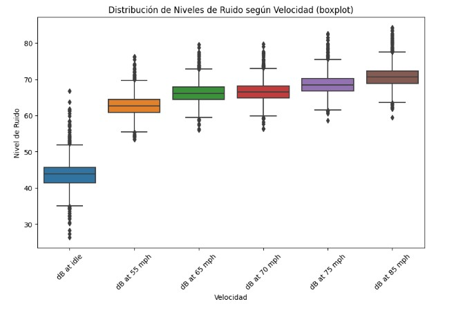 </p>

<br> <b>Ruido por marca de Auto</b>

Se puede ver que independiente de la marca, el ruido a mayor velocidad es mayor. 

Además, se observa que en posiciónat idle (regulando - velocidad 0) los valores raramente superan lo 50 dB.

El rango de velocidad que nos interesará en el estudio es at idle y 55 mph (80 km/h). Esto es porque, en general, en las ciudades grandes, raramente se superen los 80 km/h (velocidad máxima en las circunvalaciones). 

<p align= Center>
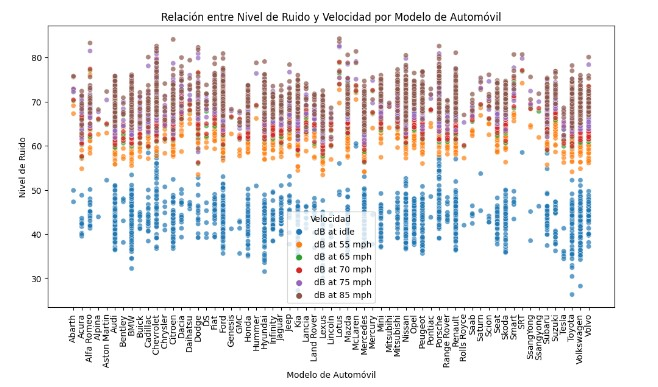 </p>

<br> <b>Ruido por año</b>

En este gráfico, podemos ver la evolución promedio del ruido en dB de autos. 

Algo a destacar, que en el rango de interés (at idle y 55mph), el ruido a disminuido en el rango temporal que se tiene.

<p align= Center>
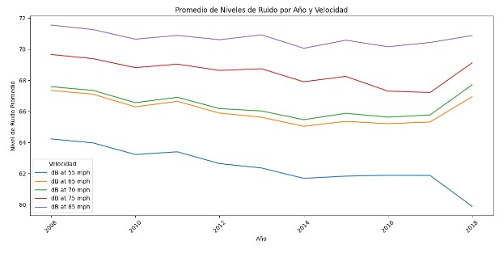 </p>

## ETL y EDA de datasets relacionados con el transporte e infraestructura

### Electric and Alternative Fuel Charging Station.csv

Contiene información sobre estaciones de carga de combustibles alternativos y vehículos eléctricos.

El conjunto de datos contiene un total de 70406 registros y 65 columnas. Las columnas proporcionan información detallada sobre las estaciones de carga de combustibles alternativos y los servicios que ofrecen.

Podemos notar que hubo un incremento de la cantidad de estaciones en estos últimos años, con un incremento importante en el año 2021.

<p align= Center>
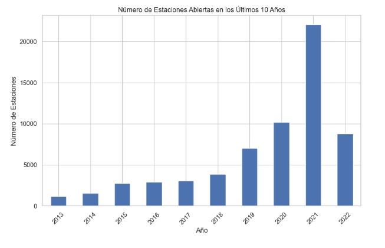 </p>

### taxi+_zone_lookup.csv

Proporciona información sobre las zonas de taxis en diferentes distritos, incluyendo detalles sobre las ubicaciones, distritos, nombres de zonas y zonas de servicio asociadas..
Consta de 265 filas y 4 columnas. Las filas representan diferentes ubicaciones de taxi en diversos distritos y zonas, junto con sus respectivas zonas de servicio.

### Yellow Taxis NY

Proporciona información detallada sobre viajes en taxis en la ciudad de Nueva York, incluyendo detalles sobre las ubicaciones de inicio y fin, tarifas, costos adicionales, propinas y otros aspectos relacionados con el servicio de taxi.

El DataFrame tiene un total de 3,513,649 filas y 19 columnas.

Algunos datos respecto a la calidad de los datos:

- Hay valores faltantes en algunas columnas (por ejemplo, en la columna "passenger_count").

- La columna "trip_distance" muestra una amplia variedad de valores, incluidos valores atípicos.

#### Distancias de viajes:

Se observa un promedio de viajes de al rededor de 2 millas (3,2 km) con máximos de hasta 7 millas (11,2 km).

<p align= Center>
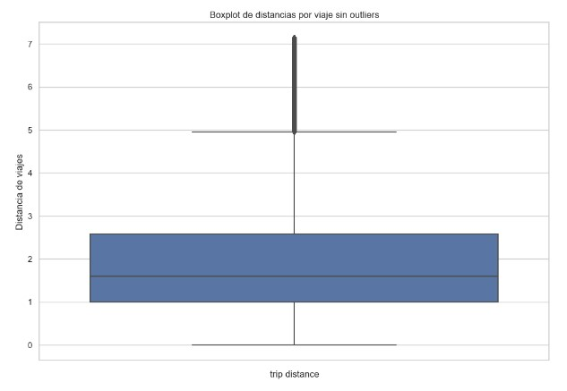 </p>

#### Costo de los viajes:

Se observa un promedio de 15 dólares por viaje sin outliers con máximos de hasta 40 dólares.

Hay algunos valores menores a 0 que habría reveer, posiblemente sean equivocados.

<p align= Center>
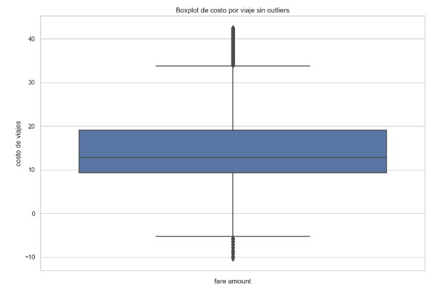 </p>

#### Modo de pago:

Para el modo de pago se debe tener en cuenta que: 0= Credit card 1= Cash 2= No charge 3= Dispute 4= Unknown 5= Voided trip

Se observa que la mayoría de los pagos son en efectivo.

<p align= Center>
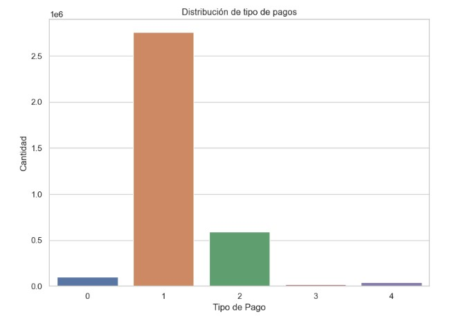 </p>

#### Viajes por zonas:

Se oberva que casi la totalidad de los viajes incluye el traslado entre distintas "*Taxi Zone*"

<p align= Center>
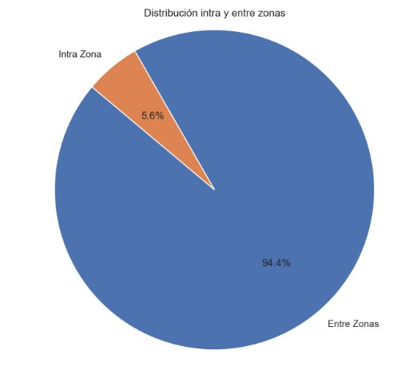 </p>

#### Viajes según cantidad de pasajeros:

Se observa que gran porcentaje de los viajes son con un pasajero, con más de 2.5 millones de viajes (el 83% del total).

Esto puede ser una señal a la hora de decidir qué modelo de auto incluir en nuestra flota, puesto que, quizás, no convenga incorporar vehículos grandes (que suelen ser más costosos).

<p align= Center>
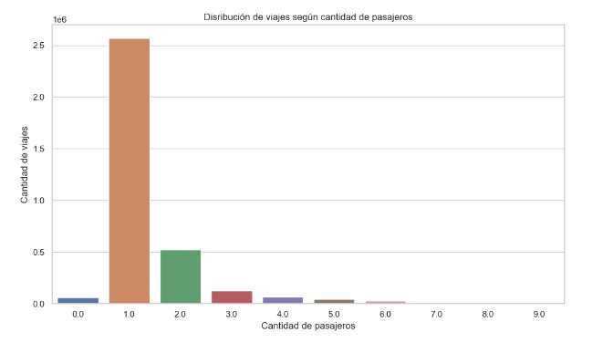 </p>

### ETL y EDA de datasets complementarios

#### API historical-weather-api

Proporciona información sobre las condiciones climáticas, incluyendo temperaturas y precipitaciones, en diferentes momentos, a lo largo de un período de tiempo de un año, con registros diarios.

El DataFrame tiene un total de 3,864 filas y 6 columnas.

Proporciona información sobre las condiciones climáticas, incluyendo temperaturas y precipitaciones, en diferentes momentos, a lo largo de un período de tiempo de un año, con registros diarios.

El DataFrame tiene un total de 3,864 filas y 6 columnas.

#### Patrón de temperaturas en el año:

En el siguiente gráfico de cajas se observa la clara tendencia de temperaturas según las estaciones del año. 

Hay que remarcar que en invierno llegan a registrarse valores extremos de hasta -20°C. Sin embargo, en los meses cálidos la temperatura no sobrepasa los 20°C, cual lo cual se deduce que Nueva York es una ciudad más bien fria.

El frio y la nieve son factores importantes a tener en cuenta en el negocio de los taxis, puesto que con temperaturas tan bajas, las personas tienden a trasladarse en el refugio abrigado de un vehículo.

<p align= Center>
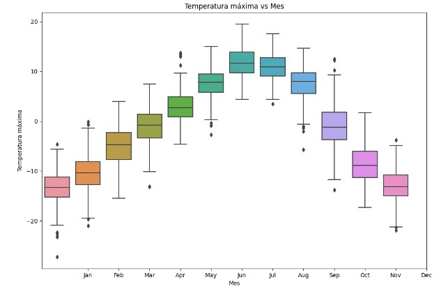 </p>

#### Patrón de precipitaciones:

La mayoría de las precipitaciones ocurren en los meses de verano.

Los días de lluvia la gente tiende a usar mayormente vehículos (para no mojarse), por ende puede ser una información útil para el negocio de los taxis.

<p align= Center>
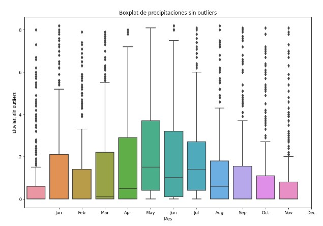 </p>

## Data Engineering :wrench: 
**

Introducción a los Servicios en la Nube: una perspectiva clarificadora
Los "cloud services" o servicios en la nube representan una innovadora modalidad de recursos informáticos y aplicaciones, dispuestos a través de la red global de internet. En contraposición a la tradicional albergada en servidores locales o en infraestructuras físicas, estos servicios operan en entornos de servidores remotos, que pueden abarcar múltiples localizaciones geográficas. En esta dinámica, los proveedores de servicios en la nube brindan a los usuarios una variada gama de capacidades, que incluyen capacidad de almacenamiento, potencia de procesamiento, bases de datos, programas y herramientas, todo accesible bajo demanda.

Los servicios en la nube se pueden dividir en tres categorías fundamentales:

Software as a Service (SaaS): Bajo este modelo, los usuarios acceden a aplicaciones y software directamente a través de internet. La instalación y mantenimiento de software en dispositivos propios se torna innecesaria, ya que el procesamiento y almacenamiento se ejecutan en la nube. Ejemplos de SaaS engloban servicios como correo electrónico en línea, suites de productividad y programas de gestión empresarial.

Platform as a Service (PaaS): En esta categoría, los proveedores facilitan plataformas y herramientas para que desarrolladores puedan crear, desplegar y administrar aplicaciones en la nube. Los desarrolladores se focalizan en la creación de aplicaciones sin la carga de preocuparse por la infraestructura subyacente. Entornos de desarrollo web y bases de datos en la nube son ejemplos tangibles de PaaS.

Infrastructure as a Service (IaaS): En este modelo, se proveen recursos de infraestructura virtualizados, incluyendo servidores, almacenamiento y redes, a través de internet. Los usuarios conservan mayor control sobre la configuración y manejo de estos recursos, similar a la gestión de servidores físicos, pero sin la necesidad de contar con hardware físico. IaaS abarca máquinas virtuales y servicios de almacenamiento en la nube, entre otros.

 

Exploración de plataformas
En las primeras etapas, se tomó la decisión de analizar detenidamente tres plataformas diferentes para la implementación de nuestro Data Warehouse (DW), considerando sus características y ventajas en consonancia con nuestros objetivos.

 


Planet Scale: Introducida como una base de datos 'serverless', Planet Scale se integra armónicamente con MySQL, ofreciendo no solo escalabilidad y rendimiento, sino también un alto nivel de confiabilidad. Esta plataforma no compromete la experiencia del desarrollador. Al adoptar Planet Scale, accedemos a capacidades de fragmentación horizontal, cambios de esquema sin bloqueos y potentes funciones de base de datos, sin incurrir en las dificultades de su implementación.

Enlace a Planet Scale 

 


Render: Render se distingue por su asombrosa facilidad de uso y su sorprendente capacidad de empoderamiento, generando un entorno altamente escalable. Desde la administración de una simple página HTML hasta la gestión de aplicaciones complejas con múltiples microservicios, Render presenta una solución integral y versátil.

Enlace a Render

 


Google Cloud Platform (GCP): GCP emerge como una suite integral de servicios en la nube, diseñada y proporcionada por Google. Esta plataforma abarca desde servicios de infraestructura hasta soluciones de nivel superior. Dentro de este amplio abanico, Platform as a Service (PaaS) ocupa una posición destacada. La selección de GCP para nuestro proyecto se fundamenta en su capacidad para unificar diversas herramientas bajo un mismo paraguas, evitando la incompatibilidad de software, hardware y otros componentes. Esta cohesión contribuye significativamente a la eficiencia y coherencia en la operación del DW.

Enlace a Google Cloud Platform

Uso de Servicios Cloud (GCP)
Los servicios en la nube ofrecen una solución escalable y flexible para alojar aplicaciones, almacenar y gestionar datos, y realizar análisis en tiempo real. 

En este proyecto hemos utilizado un servicio PaaS, Google Cloud Platform (GCP), una suite completa de servicios en la nube proporcionados por Google.

La elección final se respalda en su conjunto de servicios en la nube que engloban desde computación y almacenamiento hasta análisis y aprendizaje automático. Al aprovechar las tecnologías que GCP pone a nuestra disposición, evitamos la complejidad de sincronizar múltiples herramientas de distintos proveedores. En muchos casos, estas incompatibilidades pueden traducirse en barreras software-hardware que obstaculizan la eficiencia y la cohesión. Entre las herramientas de GCP que serán de utilidad en nuestro proyecto, destacamos:

Almacenamiento y bases de datos:

Cloud Storage: Proporciona un almacenamiento en la nube escalable y duradero para objetos y archivos.

Cloud SQL: Ofrece una base de datos SQL administrada.

Análisis y Big Data:

BigQuery: Brinda un almacén de datos y análisis en tiempo real a gran escala.

Dataflow: Facilita el procesamiento de datos en tiempo real y por lotes.

Dataproc: Proporciona un servicio administrado de Apache Spark y Hadoop.

Analytics y Machine Learning:

Diversas herramientas para análisis y aprendizaje automático, tales como Tensor Flow, AI Platform, entre otros.

Servicios de identidad y seguridad:

Identity and Access Management (IAM): Ofrece control de acceso y gestión de identidades.

Otros servicios:

Cloud Functions: Posibilita la ejecución de código en respuesta a eventos.

Cloud Vision, Translation, Speech, Natural Language, Video AI: Proporciona servicios de inteligencia artificial para análisis de imágenes, traducción, reconocimiento de voz, procesamiento de lenguaje natural y análisis de video.

La elección estratégica de GCP como plataforma principal subraya nuestro compromiso con la eficiencia, la coherencia y la compatibilidad en el diseño y operación de nuestro Data Warehouse.

Arquitectura:

 

Data Warehouse.
Creación del Data Warehouse 

 

Carga inicial:

 

Carga Incremental: 
La automatización del Data Warehouse se logró mediante la programación de procesos ETL (Extracción, Transformación y Carga) utilizando Google Dataflow. Esto permitió la recopilación periódica de datos, su limpieza, transformación y carga en las tablas correspondientes.

Para garantizar la eficiencia en la carga de datos, implementamos un enfoque de carga incremental. Solo se cargaron los datos nuevos o modificados desde la última ejecución del proceso ETL, lo que redujo el tiempo de procesamiento y aseguró la consistencia de los datos.

Enlace a video - PENDIENTE

 

Diagrama de Entidad - Relación (DER)
En nuestro Data Warehouse, se crearon dos tablas de hecho y cinco tablas de dimensiones. Las tablas de hecho contienen medidas cuantitativas de interés, mientras que las tablas de dimensiones almacenan atributos descriptivos que permiten contextualizar y analizar las medidas.


 

Tablas de Hecho:

Viajes: 

Proporciona información sobre viajes que realiza la compañía en la ciudad de Nueva York, incluyendo detalles sobre las ubicaciones de inicio y fin y tarifas.

Autos_flota: 

Contiene información sobre los vehículos que son propiedad de la empresa.

Clima: 

Proporciona información sobre las condiciones climáticas, incluyendo temperaturas y precipitaciones, en diferentes momentos, a lo largo de un período de tiempo de un año, con registros diarios.

Estos datos se recogen de una API con una frecuencia mensual.

Tablas Dimensión:

Autos:  

Contiene datos detallados sobre la economía de combustible y las especificaciones técnicas de una variedad de vehículos, incluyendo información sobre consumo de combustible, emisiones de CO2 y ruido que produce el motor.

Taxi_zones: 

Proporciona información sobre las zonas de taxis en diferentes distritos, incluyendo detalles sobre las ubicaciones, distritos, nombres de zonas y zonas de servicio asociadas..

Tipo_combustible: 

Tipo de combustible del vehículo.

Clase_vehiculo: 

Tipo de combustible del vehículo (Sedan, Hatchback, SUV, Pick Up).

Marca_auto: 

Fabricante del vehículo.

Método_pago: 

Método de pago utilizado para abonar el viaje.

Analítica de datos.
Contexto
Según el artíuclo publicado siempre auto (link en Fuente), la ciudad de Nueva York ha anunciado que requerirá que las flotas de vehículos compartidos sean totalmente eléctricos para 2030.

Este es el plan de implementación de la iniciativa Green Rides: 

A partir de 2024, Nueva York requerirá que el 5 % de todos los viajes de alquile se envíen a vehículos eléctricos 

En 2025 aumentará al 15%.

En 2026 al 25%. 

En 2027 al 45%.

En 2028 al 65%.

En 2029 al 85%.

Y, finalmente, en 2030 aumentará al 100%.

Uber y Lyft, que en conjunto conforman 78,000 vehículos de viaje compartido en la ciudad de Nueva York, también se comprometieron a hacer la transición a los vehículos eléctricos para 2030.

Fuente:

Nueva York, la primera ciudad del mundo en exigir vehículos eléctricos compartidos para 2030 - Siempre Auto 

En cuanto a los taxis, también tendrán que apegarse a esta normativa.

Actualmente, en la ciudad de Nueva York hay aproximadamente 13.000 taxis, en donde se estima que el 80% son vehículos híbridos Nissan NV200.

Situación actual de la empresa Taxi Green.
La empresa Taxi Green no cuenta actualmente con una flota de autos de uso compartido o taxi.

A los fines de estimar la evolución de los indicadores principales del negocio, se evalúan los viajes realizados en la ciudad de Nueva York por la flota existente de vehículos. Con este objetivo, se desarrolla un tablero de control. 

Finalmente, se desarrolla un modelo de machine learning con la finalidad de proponer las mejores alternativas de flotas compuestas por distintos modelos de vehículos, optimizando los KPIs.
