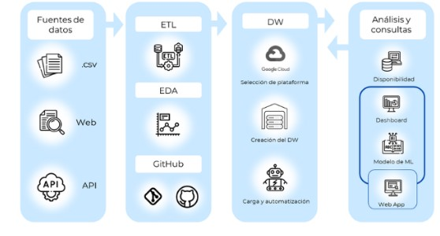
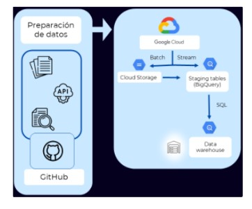
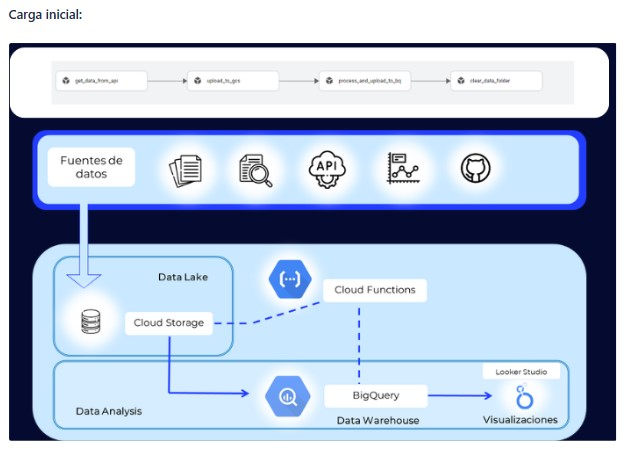
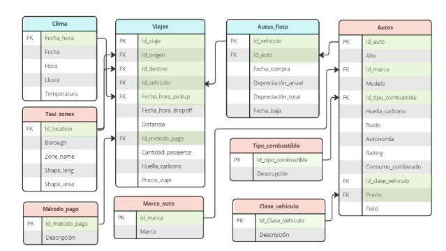
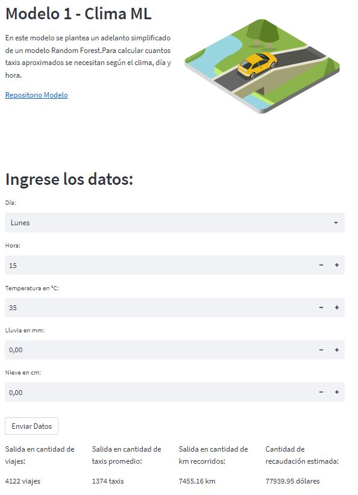
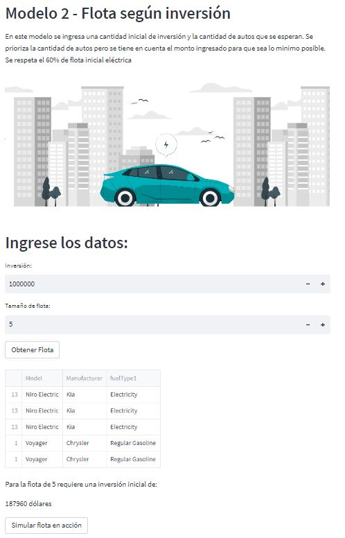
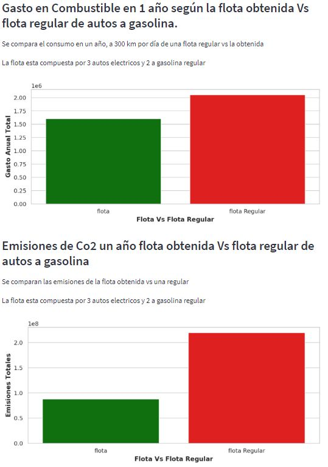

# <h1 align=center> **Proyecto Final Grupal de HENRY** </h1>

<p align=center> </p>

# <h1 align=center>**`NY_TaxiGreen: Análisis del movimiento de taxis en la ciudad de Nueva York y su relación con la calidad del aire y la contaminación sonora.`**</h1>

 📔: [Reporte Técnico Completo](https://crichubiava.atlassian.net/l/cp/14Q0CXYV)

### **`Equipo`**</h2>

<p align= left>
<br> 
<br> Araque Roldan Mauricio Alejandro
<br> <sub>  https://github.com/araquester
<br> https://www.linkedin.com/in/mauricio-araque </sub>
</p>

<p align= left>

<br> <sub>Biava, Cristian 
<br> https://github.com/Crichu
<br> https://www.linkedin.com/in/cristian-biava/ </sub>
</p>

<p align= left>

<br> <sub> López Guerra, Adriana Gabriela 
<br> https://github.com/AdrianaGLG
<br> https://www.linkedin.com/in/adriana-gabriela-lopez-guerra </sub>
</p>

<p align= left>

<br> <sub>Luna Paez, Gastón Ramiro
<br> https://github.com/ramirou2
<br> https://www.linkedin.com/in/gaston-luna-paez/ </sub>
</p>

<p align= left>

<br> <sub> Rappaport, Fernando Ariel
<br> https://github.com/TheFercho
<br> https://www.linkedin.com/in/fernando-rappaport-thefercho/ </sub>
</p> 


### **`Esquema del Repositorio`**</h3>

```Python
.
├── Complementary  (Datasets complementarios)
|       └── fuel_consumption_ratings  
|       └── yellow_taxis
    ├── air_quality_data.csv  (Dataset_CM_01)
    ├── car_noise.csv  (Dataset_CM_02)
    ├── weather.csv  (Dataset_CM_03)
├── Datasets    (Datasets bases)
|       └── Datasets_Clean  
|            ├── Alternative Fuel Vehicles US.csv
|            ├── ElectricCarData_Clean.csv
|            ├── Electric_and_Alternative_Fuel_Charging_Stations.csv
|            ├── Light Duty Vehicles.csv
|            ├── Vehicle Fuel Economy Data.csv
|            ├── taxi+_zone_lookup.csv
|            ├── taxi_zones.csv
    ├── Alternative Fuel Vehicles US.csv  (Dataset_01)
    ├── Electric and Alternative Fuel Charging Stations.csv  (Dataset_02)
    ├── ElectricCarData_Clean.csv  (Dataset_03)
    ├── ElectricCarData_Norm.csv  (Dataset_04)
    ├── Light Duty Vehicles.csv  (Dataset_05)
    ├── Vehicle Fuel Economy Data.csv  (Dataset_06)
    ├── data_dictionary_trip_records_yellow.pdf
    ├── taxi+_zone_lookup.csv (Dataset_07)
    ├── taxi_zones.dbf
├── EDA_Notebooks
    ├── EDA_Dataset_01_&_03.ipynb
    ├── EDA_Dataset_02.ipynb
    ├── EDA_Dataset_06.ipynb
    ├── EDA_Dataset_CM_01.ipynb
    ├── EDA_Dataset_CM_02_&_03_&_Tripdata_2023_05_parquet.ipynb
    ├── EDA_fuel_consumption_ratings.ipynb
├── ETL_Notebooks
|        └── Normalizacion_Columnas
|           ├── normalizacion_Datasets_bases.ipynb
|           ├── normalizacion_Datasets_complementarios.ipynb
    ├── ETL_Dataset_01_&_03_&_04_&_07.ipynb
    ├── ETL_Dataset_02.ipynb
    ├── ETL_Dataset_06.ipynb
    ├── ETL_Dataset_07.ipynb
    ├── ETL_Dataset_CM_01.ipynb
    ├── ETL_Dataset_CM_02_&_03.ipynb
    ├── ETL_fuel_consumption_ratings.ipynb
├ .gitignore
├ README.md
├ requirements.txt


```

# <h2 align=left> **Informe** </h2>

### **`Propósito del proyecto`**

​Taxi Green, una empresa de servicios de transporte de pasajeros, que actualmente se encuentra operando en el sector de micros de media y larga distancia, está interesada en invertir en el sector de transporte de pasajeros con automóviles.

Con una visión de un futuro menos contaminado y ajustarse a las tendencias de mercado actuales, quieren corroborar la relación entre estos medios de transporte particulares con:

* Calidad del aire

* Contaminación sonora

Propósito: estudiar la posibilidad de implementar vehículos eléctricos a su flota; ya sea en su totalidad o parte de la misma.

Se pretende hacer un análisis preliminar del movimiento de los taxis en la ciudad de Nueva York, para poder obtener un marco de referencia y poder tomar decisiones bien fundamentadas.​

### **`Objetivo general`**

Análisis del movimiento vehicular en NYC y su relación con la contaminación del aire y sonora.

### **`Objetivos específicos`**

Comprobar:

Relación entre el mercado automotor y las actividades de transporte en la ciudad de Nueva York con:

    *   La calidad del aire (emisiones de CO2).

    *   La contaminación sonora.

    *   Efecto de las condiciones climáticas con la cantidad de viajes solicitados. 

### **`KPIs Propuestos`**

Se proponen los siguientes KPIs con base de medición trimestral:

* Promedio de emisión de CO2 de la nueva flota menor a 3


* Ruido promedio por diseño de la nueva flota 50 dB


  
* Vehículos eléctricos en la flota > 60%


  
* autonomía de la nueva flota entre > 300 km


  
* Antigüedad de la flota < 3 años (ningún vehículo puede tener más de 3 años)


### **`Alcance (Desarrollar)`**

> [!IMPORTANT]
> Crucial information necessary for users to succeed.
> Debe tener:
>  * Análisis descriptivo del movimiento de los taxis en NYC (patrones por semana, franja horaria). Si hay datos, incluir también: micros, uber, vehículos particulares, tipos de motor (combustible, eléctrico, híbrido).
>
> * Análisis descriptivo de la relación entre uso de medios de transporte particulares y la calidad del aire según el área (¿Qué medios se utilizan y cuál es el nivel de contaminación del aire?).
>
> * Análisis descriptivo de la relación entre uso de medios de transporte particulares y la contaminación sonora (¿Qué medios se utilizan y cuál es el nivel de contaminación sonora?).
>
> * Modelo predictivo ML: evolución de la calidad del aire en función del uso de los medios de transporte (distintos escenarios considerando distintos tipos de medios de transporte)
>
> * Modelo predictivo ML: modelar la evolución de la contaminación sonora en función del uso de los medios de transporte (distintos escenarios considerando distintos tipos de medios de transporte)
>
> * Aplica para todo: comparar datos de autos a combustión, autos eléctricos, autos híbridos (la actividad que quiere estudiar la empresa) vs micros (la actividad actual de la empresa)

> [!NOTE]\
> Podría tener:
> * Modelo para analizar tarifas variables en base al movimiento de las distintas franjas de días y horarios y condiciones climáticas.
> * Análisis del retorno de la inversión en una flota de autos eléctricos.

> [!WARNING]\
> Fuera del alcance:
> * Análisis de marketing
> * Calificación de servicios y/o condutores

### **`Matriz de responsabilidades`**

:black_circle: Main

:small_red_triangle:  Support


# <h2 align=left> **Plan de trabajo** </h2>

| Hito | Nombre | Entregables | Esperado | Fecha |
|:---------------:|:---------:|:---------:|:---------:|:---------:|
| Demo Sprint #1 | Data Ingest  Process | Puesta en marcha el proyecto y Trabajando los Datos: <br> * Kickoff del proyecto  <br>* Entendimiento de las necesidades <br>* Documentar alcance , objetivo y entregables <br>* KPI’s <br>* Implementación de stack propuesto | * Más de 4 KPIs <br>* Mencionar las tecnologías a usar <br>* Documentación de alcance del proyecto <br>* EDA preliminar, calidad del dato <br>* Repo Github <br>* Planificación y estimación de esfuerzos (Diagrama de Gantt) | 09/08/2023 |
|Demo Sprint #2 | Data Analytics & ML |Data Engineering:<br> * Arquitectura propuesta y diagrama<br> * Diccionarios de datos <br> * Creación del DW <br> * Automatizar el DW <br> * Carga incremental | * DW con herramientas Big Data (HDFS, Hive, Spark y/o motores No-SQL y/o Servicios Cluod) <br> * DW automatizado con carga inicial <br> * Al menos 2 tablas de hechos y 5 dimensionales  <br> * Carga incremental de datos (video) | 23/08/2023
| Demo Sprint #3 | Data Analytics y ML |Etapa de Analytics y Machine Learning <br> * Dashboard <br> * Reportes <br> * Storytelling <br> * Modelo ML <br> * Ajustes del modelo |* Implementar modelo de ML <br> * Implementar un reporte de visualización geográfica.|06/09/2023
| |Demo Final |  * Demo general del proyecto <br> * Entregable final<br> * Documentación| * Presentación dirigida a la dirección de la compañía. <br> * Retomar lo mostrado en presentaciones anteriores. <br> * Retoques finales en base a recomendaciones de HM y PO. | 06/09/2023 |
***

### <h3 align=left>**`Propuesta de trabajo`** </h3>
***

### Recopilación y limpieza
- [x] Se utilizan los archivos .csv provistos por el cliente. También se estudian los datasets complementarios facilitados por el cliente, así como también información extra recopilada por el equipo.
- [x] Los datasets provienen tanto de archivos .csv como de APIs. Estos últimos son extraídos con técnicas de web scrapping. 
- [x] Los dataset considerados necesarios para el desarrollo del producto final del proyecto, se limpian, ordenan y normalizan.
- [x] Además, se realiza un análisis exploratorio de datos con el objetivo de detectar insights de interés para el cliente.

`Tecnología y librerías utilizadas: Python, Pandas, Numpy, os`

### Creación de un diccionario y diagrama DER
- [x] Los datasets son procesados y analizados para generar un diccionario de las variables de interés. 
- [x] Se utiliza esta información para establecer un diagrama de entidad - relación que facilite su posterior análisis

### Disponibilización de la información
- [x] Se crea un DataWarehouse utilizando las herramientas Cloud de Google.

`Tecnología y librerías utilizadas: MySQL, Google Cloud`

### Análisis de la información y Dashboard interactivo
- [x] Se diseña un dashboard con información relevante para el negocio teniendo en cuanta los KPIs definidos para tal fin.

`Tecnología y librerías utilizadas: Power BI / Streamlit /Locker studio?`

### Modelo de Machine Learning
- [x] Modelo predictivo ML: evolución de la calidad del aire en función del uso de los medios de transporte (distintos escenarios considerando distinta composición de la flota en cuanto a modelos de auto)
- [x] Modelo predictivo ML: modelar la evolución de la contaminación sonora en función del uso de los medios de transporte (distintos escenarios considerando distinta composición de la flota en cuanto a modelos de auto)

`Tecnología y librerías utilizadas: Python, Pandas, Numpy, Seaborn, Matplotlib, sklearn`

### App / Web interactiva
- [x] El modelo de machine learnig de disponibiliza a través de una página web, facilitando la interacción con el cliente.
- [x] Tecnología y librerías utilizadas: Python, FastAPI, Render

### <h3 align=left>**`Definición de identidad visual de marca`** </h3>

### Desarrollo de un logotipo

El desarrollo de un logotipo implica la creación de un símbolo visual o un diseño gráfico que representa la esencia de la marca. El logotipo puede consistir en una combinación de elementos como formas, letras, imágenes o iconos que juntos comunican la identidad y los valores de la empresa. 

Para nuestro proyecto, desarrollamos el logotipo de la empresa consultora (Taxi Green) y el de nuestro grupo de trabajo (LBD) a través de la evaluación de las alternativas que ofrecían plataformas de diseño tales como:

- Tailor Brands | Small Business Set-up Made Easy 
- Logo Maker | Used By 2.3 Million Startups  
- Diseña un Logo con Nuestro Creador de Logo Gratis | FreeLogoServices  
- Crear Logos Gratis - Creador de logos - Free Logo Design

### Opciones de logo
|  |  |  |  |  |
|:---------------:|:---------:|:---------:|:---------:|:---------:| 
|  |  |  |  |  |

### Grupalmente se definió el diseño final del grupo de trabajo:

<p align= Center>Logo Final Empresa <br>
 </p>

<p align= Center>Logo Corporativo <br>
 </p>


## Data Engineering :wrench: 

### Introducción a los Servicios en la Nube: una perspectiva clarificadora
Los "cloud services" o servicios en la nube representan una innovadora modalidad de recursos informáticos y aplicaciones, dispuestos a través de la red global de internet. En contraposición a la tradicional albergada en servidores locales o en infraestructuras físicas, estos servicios operan en entornos de servidores remotos, que pueden abarcar múltiples localizaciones geográficas. En esta dinámica, los proveedores de servicios en la nube brindan a los usuarios una variada gama de capacidades, que incluyen capacidad de almacenamiento, potencia de procesamiento, bases de datos, programas y herramientas, todo accesible bajo demanda.

Los servicios en la nube se pueden dividir en tres categorías fundamentales:

1. Software as a Service (SaaS): Bajo este modelo, los usuarios acceden a aplicaciones y software directamente a través de internet. La instalación y mantenimiento de software en dispositivos propios se torna innecesaria, ya que el procesamiento y almacenamiento se ejecutan en la nube. Ejemplos de SaaS engloban servicios como correo electrónico en línea, suites de productividad y programas de gestión empresarial.

2. Platform as a Service (PaaS): En esta categoría, los proveedores facilitan plataformas y herramientas para que desarrolladores puedan crear, desplegar y administrar aplicaciones en la nube. Los desarrolladores se focalizan en la creación de aplicaciones sin la carga de preocuparse por la infraestructura subyacente. Entornos de desarrollo web y bases de datos en la nube son ejemplos tangibles de PaaS.

3. Infrastructure as a Service (IaaS): En este modelo, se proveen recursos de infraestructura virtualizados, incluyendo servidores, almacenamiento y redes, a través de internet. Los usuarios conservan mayor control sobre la configuración y manejo de estos recursos, similar a la gestión de servidores físicos, pero sin la necesidad de contar con hardware físico. IaaS abarca máquinas virtuales y servicios de almacenamiento en la nube, entre otros.

 

### Exploración de plataformas

En las primeras etapas, se tomó la decisión de analizar detenidamente tres plataformas diferentes para la implementación de nuestro Data Warehouse (DW), considerando sus características y ventajas en consonancia con nuestros objetivos.

 
<p align= left>
 Planet Scale: Introducida como una base de datos 'serverless', Planet Scale se integra armónicamente con MySQL, ofreciendo no solo escalabilidad y rendimiento, sino también un alto nivel de confiabilidad. Esta plataforma no compromete la experiencia del desarrollador. Al adoptar Planet Scale, accedemos a capacidades de fragmentación horizontal, cambios de esquema sin bloqueos y potentes funciones de base de datos, sin incurrir en las dificultades de su implementación. </p>

[Enlace a Planet Scale](https://planetscale.com/)

<p align= left>
 Render: Render se distingue por su asombrosa facilidad de uso y su sorprendente capacidad de empoderamiento, generando un entorno altamente escalable. Desde la administración de una simple página HTML hasta la gestión de aplicaciones complejas con múltiples microservicios, Render presenta una solución integral y versátil.</p>

[Enlace a Render](https://render.com/)

<p align= left>
 Google Cloud Platform (GCP): GCP emerge como una suite integral de servicios en la nube, diseñada y proporcionada por Google. Esta plataforma abarca desde servicios de infraestructura hasta soluciones de nivel superior. Dentro de este amplio abanico, Platform as a Service (PaaS) ocupa una posición destacada. La selección de GCP para nuestro proyecto se fundamenta en su capacidad para unificar diversas herramientas bajo un mismo paraguas, evitando la incompatibilidad de software, hardware y otros componentes. Esta cohesión contribuye significativamente a la eficiencia y coherencia en la operación del DW.</p>

[Enlace a Google Cloud Platform](https://cloud.google.com/)

### Uso de Servicios Cloud (GCP)

Los servicios en la nube ofrecen una solución escalable y flexible para alojar aplicaciones, almacenar y gestionar datos, y realizar análisis en tiempo real. 

En este proyecto hemos utilizado un servicio PaaS, Google Cloud Platform (GCP), una suite completa de servicios en la nube proporcionados por Google.

La elección final se respalda en su conjunto de servicios en la nube que engloban desde computación y almacenamiento hasta análisis y aprendizaje automático. Al aprovechar las tecnologías que GCP pone a nuestra disposición, evitamos la complejidad de sincronizar múltiples herramientas de distintos proveedores. En muchos casos, estas incompatibilidades pueden traducirse en barreras software-hardware que obstaculizan la eficiencia y la cohesión. Entre las herramientas de GCP que serán de utilidad en nuestro proyecto, destacamos:

#### Almacenamiento y bases de datos:

- Cloud Storage: Proporciona un almacenamiento en la nube escalable y duradero para objetos y archivos.
- Cloud SQL: Ofrece una base de datos SQL administrada.

#### Análisis y Big Data:

- BigQuery: Brinda un almacén de datos y análisis en tiempo real a gran escala.
- Dataflow: Facilita el procesamiento de datos en tiempo real y por lotes.
- Dataproc: Proporciona un servicio administrado de Apache Spark y Hadoop.

#### Analytics y Machine Learning:

- Diversas herramientas para análisis y aprendizaje automático, tales como Tensor Flow, AI Platform, entre otros.

#### Servicios de identidad y seguridad:

- Identity and Access Management (IAM): Ofrece control de acceso y gestión de identidades.

#### Otros servicios:

- Cloud Functions: Posibilita la ejecución de código en respuesta a eventos.
- Cloud Vision, Translation, Speech, Natural Language, Video AI: Proporciona servicios de inteligencia artificial para análisis de imágenes, traducción, reconocimiento de voz, procesamiento de lenguaje natural y análisis de video.

La elección estratégica de GCP como plataforma principal subraya nuestro compromiso con la eficiencia, la coherencia y la compatibilidad en el diseño y operación de nuestro Data Warehouse.

## Arquitectura:

<p align= left>
</p>
 
## Data Warehouse.
Creación del Data Warehouse 
<p align= left>
</p>
 
<p align= left>
</p>
 

## Carga incremental

La automatización del Data Warehouse se logró mediante la programación de procesos ETL (Extracción, Transformación y Carga) utilizando Google Composer. Esto permitió la recopilación periódica de datos desde las fuentes mencionadas anteriormente, su limpieza, transformación y carga en las tablas correspondientes.

Para garantizar la eficiencia en la carga de datos, implementamos un enfoque de carga incremental. Solo se cargaron los datos nuevos o modificados desde la última ejecución del proceso ETL, lo que redujo el tiempo de procesamiento y aseguró la consistencia de los datos.

:movie_camera:[](https://youtu.be/kh66sdnBeBg?si=-Qd40kqjLXDA4ALa):movie_camera:
 

## Diagrama de Entidad - Relación (DER)
En nuestro Data Warehouse, se crearon dos tablas de hecho y cinco tablas de dimensiones. Las tablas de hecho contienen medidas cuantitativas de interés, mientras que las tablas de dimensiones almacenan atributos descriptivos que permiten contextualizar y analizar las medidas.

<p align= left>
</p>
 


### Analítica de datos.

## Contexto
Según el artíuclo publicado siempre auto (link en Fuente), la ciudad de Nueva York ha anunciado que requerirá que las flotas de vehículos compartidos sean totalmente eléctricos para 2030.

Este es el plan de implementación de la iniciativa Green Rides: 

- A partir de 2024, Nueva York requerirá que el 5 % de todos los viajes de alquile se envíen a vehículos eléctricos 
- En 2025 aumentará al 15%.
- En 2026 al 25%. 
- En 2027 al 45%.
- En 2028 al 65%.
- En 2029 al 85%.
- Y, finalmente, en 2030 aumentará al 100%.

[Uber y Lyft](https://siempreauto.com/uber-y-lyft-deberan-ser-100-electricas-en-nueva-york-para-2030/), que en conjunto conforman 78,000 vehículos de viaje compartido en la ciudad de Nueva York, también se comprometieron a hacer la transición a los vehículos eléctricos para 2030.

> EDA Detalle
> Fuente:
>
> [Nueva York, la primera ciudad del mundo en exigir vehículos eléctricos compartidos para 2030 - Siempre Auto 
](https://siempreauto.com/nueva-york-la-primera-ciudad-del-mundo-en-exigir-vehiculos-electricos-compartidos-para-2030/)
En cuanto a los taxis, también tendrán que apegarse a esta normativa.

Actualmente, en la ciudad de Nueva York hay aproximadamente 13.000 taxis, en donde se estima que el 80% son vehículos híbridos Nissan NV200.

## Situación actual de la empresa Taxi Green.
La empresa Taxi Green no cuenta actualmente con una flota de autos de uso compartido o taxi.

A los fines de estimar la evolución de los indicadores principales del negocio, se evalúan los viajes realizados en la ciudad de Nueva York por la flota existente de vehículos. Con este objetivo, se desarrolla un tablero de control. 

Finalmente, se desarrolla un modelo de machine learning con la finalidad de proponer las mejores alternativas de flotas compuestas por distintos modelos de vehículos, optimizando los KPIs.

## Dashboard

### Tecnologías utilizadas

El desarrollo del panel de control se materializó a través de Looker, una aplicación de visualización integrada al entorno de Google Cloud Platform.

#### 1- Flota Propuesta

El objetivo de esta pantalla es evaluar la flota de vehículos en vistas a los indicadores clave del negocio.

A modo de ejemplo, utilizamos una de las combinaciones propuestas por el modelo de optimización de parámetros que se explica más adelante. La idea es que, una vez que el negocio esté en marcha, estos datos se reemplacen por los reales.

<p align= center>
</p>

En la parte superior, se puede observar el detalle de cada vehículo.

En el ejemplo, la flota se compone de 300 vehículos, de los cuales 240 son eléctricos Kia Niro y 60 son híbridos distribuidos entre Hyundai Sonata y Chevrolet Malibu y suponen una inversión de 11 millones de dólares.

Abajo se evalúan los KPIs:

Emisiones de CO2.

Habíamos planteado que en promedio la emisión por diseño sea menor a 20 g/km. El promedio está un poco por encima del target, así lo indica la etiqueta roja. 

Composición de la flota

En el siguiente gráfico se visualiza que el 80% de lo vehículos tienen motor híbrido, cuando nuestro objetivo era lograr un mínimo de 60%. Se cumple el objetivo, por eso la etiqueta verde.

Por otro lado, es interesante remarcar que el gobierno de Nueva York ya puso en marcha un plan para migrar el 100% de la flota de taxis y autos compartidos a eléctricos para el 2030. Con esto ya estaría muy cerca de cumplirse, adicionando que seguramente también haya, en un futuro incentivos para comprar autos eléctricos y premios para la empresas que cumplan los objetivos.

Ruido

Autonomía

De la misma forma se evalúa el ruido promedio y la autonomía de los vehículos. 

En este último caso,  proponemos el target de 300 km porque un taxi recorre, en promedio, 290 km por día. Por lo cual, de esta forma, el chofer podría cumplir toda su jornada laboral con un solo tanque.

#### 2- Emisiones de CO2

<p align= center>
</p>

Podemos encontrar:

•Un filtro que permite seleccionar mes-año para ver datos particulares de algún período de interés.
•La cantidad de viajes realizados,
•Las emisiones totales y
•Las emisiones en g / km promedio durante el período seleccionado

En el gráfico de columnas se puede ver cómo evolucionan las emisiones de CO2/km mes a mes.

En promedio, las emisiones de CO2 /km están muy arriba de target que hemos propuesto. Por ende, el objetivo de 20 g/km es muy desafiante. Remarcamos aquí que los casi 29,8 g/km, si bien no cumple con el objetivo propuesto, es una mejora considerable de la situación actual.

#### 3 - Análisis económico

Esta imagen tiene como misión presentar información para el análisis de aspecto económico del negocio que, si bien no fue planteado como KPI en el inicio, siempre es una variable importante a la hora de definir la concreción o no de un proyecto.

<p align= center>
</p>

En esta imagen podemos ver:

•La cantidad de viajes realizados
•Los ingresos totales
•Y el promedio de los ingresos por viaje

Abajo, en el gráfico combinado, las columnas representan la facturación mensual y la línea verde la facturación acumulada.

La línea horizontal blanca representa la inversión inicial de 11 millones que mencioné al principio y el objetivo de su presencia es visualizar cuándo se recupera la inversión. En este caso, tardaría 8 meses.

Acá es necesario hacer una aclaración. Estos datos son de la base de datos general de taxis, por ende, no podemos pretender hacer estos cálculos con el 100% de los datos ya que esto implicaría tener una cuota de mercado del 100%, un monopolio.

Para resolver esta cuestión, se agregó una métrica que tiene como objetivo evaluar distintos escenarios dependiendo de la penetración de mercado objetivo y esto sirve para poder predecir la facturación y el retorno de la inversión en cada uno de los mismo. En la imagen, se muestra un excenario con el 1% de participación de mercado.

Por otra parte, a la derecha hay un mapa de calor que permite visualizar en qué zonas inician los viajes más rentables.

### Modelos de machine learning

:link:[Click Aqui para acceder al modelo](https://taxigreenmodels-pf.streamlit.app/):link:

#### Modelo 1: Modelo ML - Clima Descripción General

En este modelo se empleo Machine Learning, puntualmente un modelo de Random Forest, el cual fue entrenado con datos de los viajes de los Yellow Taxis en Manhattan - New York asociado a los datos climáticos correspondientes al momento del viaje.

- Variables climáticas: Temperatura, Nieve, Lluvia
- Variables temporales: Hora, Día de la semana.
- Variables de viajes: Cantidad de viajes por hora, Total de km recorridos, Total de dinero recaudado

**Stack tecnológico:**

> Python: Pandas, Numpy, Matplotlib, Seaborn, Scikit Learn, Request, Os.

**Uso**

Se ingresa Día de la semana, Hora, Temperatura, Lluvia y Nieve.

El modelo devuelve: 

- Cantidad de viajes
- Cantidad de taxis necesarios
- Km recorridos
- Ingresos potenciales

<p align= center>
</p>

__Modelo 2: Modelo Optimización de flota__

En términos de las condiciones propuestas, 60% de flota eléctrica, minimización de emisiones y minimización de ruidos. Se realizó un modelo de optimización empleando metodologías lineales, que si bien parecen simplificado tienen un muy buen desempeño y a gran velocidad sin necesidad de recurrir a metodologías más complejas.

Entrada: Datos de autos autorizados para desempeño de viajes, Cantidad de autos necesarios, Dinero inicial

Salida: Flota optimizada en términos de la entrada y las restricciones asociadas al proyecto.

__Stack tecnológico:__

> Python: Os, Pulp, Pandas, Numpy

__Uso:__

Se ingresa: 

Inversión estimada

Cantidad de autos desaeados en la flota

El modelo devuelve:

Un listado de vehículos recomendados.

<p align= center>
</p>

Este modelo también tiene la posibilidad de simular  el consumo de combustible, y el CO2 emitido en 1 año, comparando la flota propuesta vs un flota promedio.

<p align= center>
</p>

####  Despliegue de los modelos
En términos de conseguir un despliegue de bajo o nulo costo, luego de analizar diversas alternativas, se seleccionó Streamlit Cloud.

Por ende, se utilizó su framework asociado para desarrollar un despliegue MVP: Producto Viable Mínimo.

__Stack tecnológico:__

> Python: Streamlit, Pandas, Numpy, Request, Seaborn, Matplotlib

>Despliegue: Streamlit Cloud

### Conclusiones

- Generar una flota amigable con el ambiente.
- Uso de los sistemas de IA para el desarrollo de algoritmos de ML que permitirán ajustar los diversos parámetros en tiempo real para optimizar los ingresos
  tanto de la empresa como de los conductores.
- Capacitación al personal en las herramientas desarrolladas para el uso eficiente del producto ofrecido.
- Acompañamiento durante todo el proceso de incorporación y adaptación de las nuevas tecnologías para lograr el retorno efectivo de la inversión inicial.
- Obtención de una herramienta que basada en los modelos de Machine Learning le permitirá predecir los resultados optimos para gestionar la flota que se decida
  obtener.
